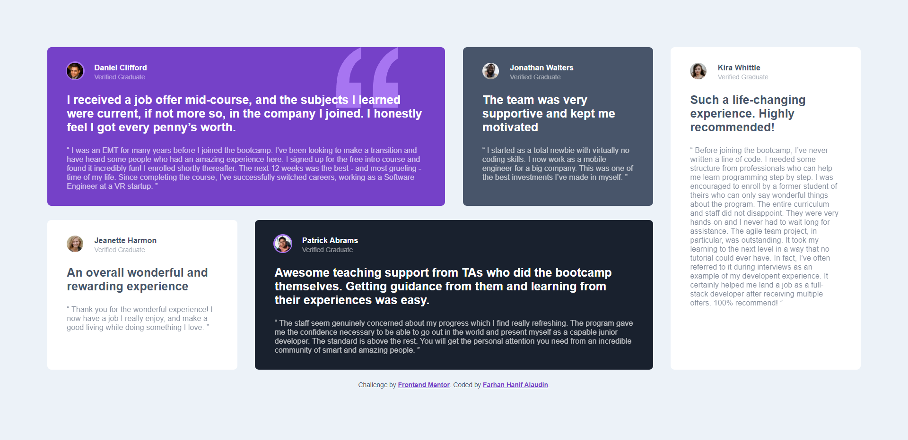
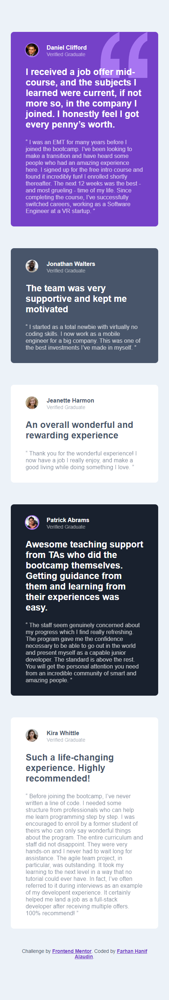

# Frontend Mentor - Testimonials grid section solution

This is a solution to the [Testimonials grid section challenge on Frontend Mentor](https://www.frontendmentor.io/challenges/testimonials-grid-section-Nnw6J7Un7). Frontend Mentor challenges help you improve your coding skills by building realistic projects. 

## Table of contents

- [Overview](#overview)
  - [The challenge](#the-challenge)
  - [Screenshot](#screenshot)
  - [Links](#links)
- [Built with](#built-with)
- [Author](#author)

## Overview

### The challenge

Users should be able to:

- View the optimal layout for the site depending on their device's screen size

### Screenshot

- Desktop Screenshot

- Mobile Screenshot

### Links

- Solution URL: [https://github.com/fhaladin/testimonials-grid-section-main](https://github.com/fhaladin/testimonials-grid-section-main)
- Live Site URL: [https://fhaladin.github.io/testimonials-grid-section-main/](https://fhaladin.github.io/testimonials-grid-section-main/)

### Built with

- SCSS
- CSS Grid
- Mobile-first workflow
- BEM concept

## Author

- Medium - [@fhaladin-dev](https://www.fhaladin-dev.medium.com)
- Frontend Mentor - [@fhaladin](https://www.frontendmentor.io/profile/fhaladin)
- Linkedin - [Farhan Hanif Alaudin](https://www.linkedin.com/in/farhan-hanif-alaudin-11412a139/)
